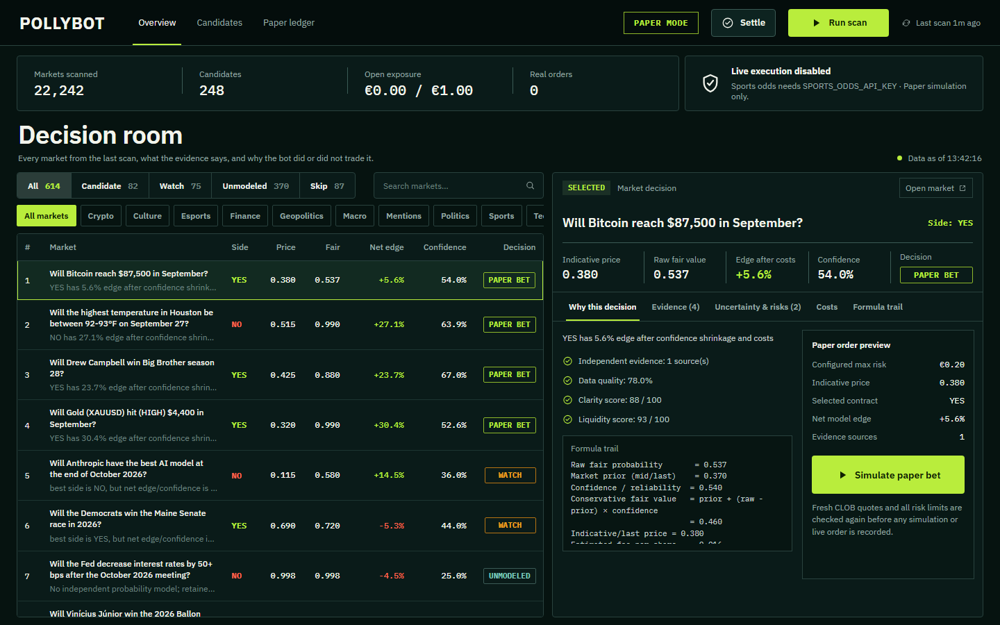

# Pollybot

Pollybot looks for mispriced markets on Polymarket. It pulls the open yes/no markets, gathers outside evidence for each one (weather forecasts, sports odds, crypto prices, macro data, news headlines), makes its own probability estimate and compares that with what the market charges after fees and slippage. When a market still looks wrong by enough, it places a paper trade.

Paper trading is the default. Every estimate is logged, so once markets resolve you can check how well calibrated it was. A real-money path exists in the code, but it is switched off and sits behind several separate checks.



## How a decision is made

Pollybot keeps the market price, the evidence and its confidence in that evidence as separate numbers. The less confident it is, the closer its fair value stays to the market price:

```text
fair = market_prior + (evidence_estimate - market_prior) * confidence
edge = fair - ask - fee - slippage
```

A trade needs positive edge after costs, enough liquidity and a fresh quote. Size comes from fractional Kelly and is then capped per order, per market, per event, by total exposure and by daily loss. An LLM can look at a candidate and veto it. It cannot set the probability or place an order.

## Running it

You need Node.js 22 or newer.

```bash
npm ci
npm run dev
```

Open http://127.0.0.1:5173 and press **Run scan**. No API keys are needed for the default sources. Sports odds need a `SPORTS_ODDS_API_KEY` in `.env.local`. Copy `.env.example` to `.env.local` to start; the rest of that file is risk limits and thresholds you can tune.

The same work can be done from the command line:

```bash
npm run scan       # fetch and rank markets
npm run paper      # paper trade the candidates that qualify
npm run settle     # settle paper positions on resolved markets
npm run diagnose   # print what is blocking trades and why
npm run report     # exposure, results and calibration
```

## Code

| Folder | Contents |
| --- | --- |
| `src/providers/polymarket` | market data, order book, geoblock check, order client |
| `src/sources` | evidence sources: weather, sports, crypto, macro, news, manual notes |
| `src/probability` | the estimate heuristics and the optional LLM review |
| `src/ranking` | ranking after costs, spread and time to resolution |
| `src/trading` | risk limits, paper trader, settlement, the guarded live path |
| `src/reports` | results and calibration reports |
| `src/server`, `src/web` | local API and the React dashboard |

Data is stored in SQLite under `data/`.

## Tests

There are 137 tests on Node's built-in test runner. They cover sizing and risk limits, settlement, each evidence source, the live-trading guards and a few full scan-to-trade runs against mocked HTTP responses.

```bash
npm run typecheck
npm test
npm run build
```

CI runs those three plus `npm audit` on every push.

## Notes

This repository is a public copy of a private project. It contains no keys, wallets, databases or trade history, and `data/`, `logs/` and `.env.local` are git-ignored.

None of this is financial advice. Paper results say nothing about real returns.
