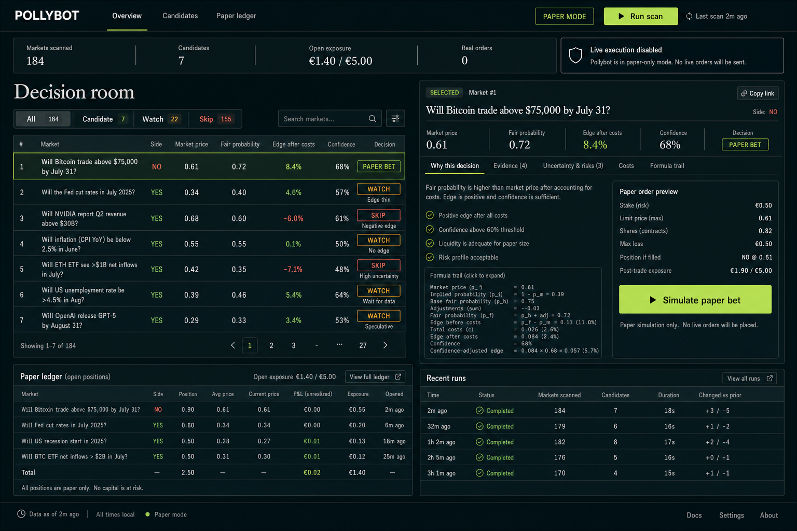

# Pollybot

An evidence-first prediction-market research system with a React decision room, source-aware probability estimates, paper execution, calibration reporting, and strict risk controls.



## What this project demonstrates

- A TypeScript pipeline that scans and normalizes active binary markets.
- Structured evidence adapters for weather, sports, macro, crypto, technology, culture, news, and manual research notes.
- Probability estimates that keep market prices, model evidence, and uncertainty separate.
- Execution-aware ranking using liquidity, spread, quote freshness, fees, slippage, and time to resolution.
- Fractional-Kelly sizing constrained by per-order, per-market, per-event, exposure, and loss limits.
- Paper trading, settlement, diagnostics, calibration analysis, and outcome reporting backed by SQLite.
- A guarded live execution path that remains disabled unless several independent safety checks pass.
- A responsive React dashboard for inspecting candidates, evidence, blockers, and account state.

The LLM layer is deliberately limited to review and veto assistance. It cannot create the base probability, override hard risk rules, or place an order by itself.

## Public snapshot and safety

This repository is a clean portfolio snapshot of a local research project. It does not contain wallet credentials, API secrets, SQLite databases, order history, logs, or the original private development history.

The checked-in defaults are paper-first:

```env
DRY_RUN=true
ENABLE_REAL_TRADING=false
ENABLE_DIRECTIONAL_LIVE_TRADING=false
```

The live path also checks account readiness, geoblocking, calibration, market quality, exposure, and explicit activation settings. A failed or unavailable safety check blocks execution.

No strategy can guarantee profit. This project is software and research work, not financial advice.

## Run locally

Requirements: Node.js 22 or newer.

```bash
npm ci
npm run dev
```

Open `http://127.0.0.1:5173`.

The default configuration is suitable for exploring the interface and paper workflow. Optional providers can be enabled by copying `.env.example` to `.env.local` and adding only the keys you want to use. Never commit `.env.local`.

Useful commands:

```bash
npm run scan       # fetch and rank current candidates
npm run paper      # run the paper-trading workflow
npm run diagnose   # explain configuration and system blockers
npm run report     # inspect exposure, outcomes, and calibration
npm run typecheck
npm test
npm run build
```

Real-money commands are intentionally not part of the quick-start path.

## Architecture

```text
src/
├── providers/polymarket/  market, order-book, geoblock, and order adapters
├── sources/               structured evidence providers
├── probability/           heuristic estimates and optional LLM review
├── ranking/               execution-aware opportunity ranking
├── trading/               risk manager, paper trader, settlement, guarded live path
├── reports/               performance and calibration reporting
├── server/                local dashboard API
└── web/                   React decision room
```

The project keeps source evidence, model judgment, trade eligibility, and order execution as separate stages. That makes each decision reviewable and lets hard safety rules stay deterministic.

## Verification

The repository CI runs:

```bash
npm ci
npm run typecheck
npm test
npm run build
npm audit --audit-level=high
```

Tests cover configuration safety, scoring and decision rules, evidence-source behavior, scanner logic, order sizing, settlement, live-trading guards, and arbitrage constraints.

## Data handling

Runtime data belongs in `data/`, logs belong in `logs/`, and credentials belong in `.env.local`. All three are excluded from Git. The public snapshot includes only code, tests, documentation, a safe example configuration, and design assets.
